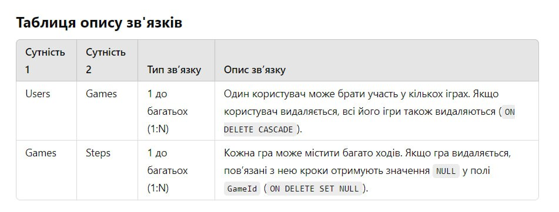
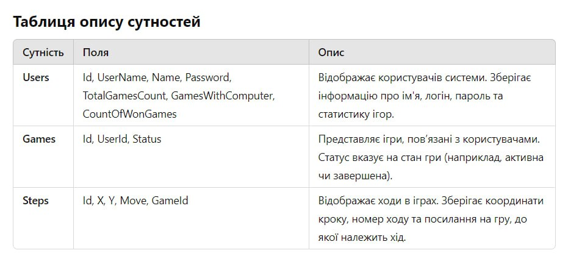

##Дані користувача:

### Users.Id → Primary Key
Дані про унікальний ідентифікатор кожного користувача, який використовується для ідентифікації в системі.

### Users.UserName → Унікальне ім’я користувача
Унікальний логін для доступу до системи. Зберігається для ідентифікації та аутентифікації користувачів.

### Users.Name → Повне ім’я користувача
Ім’я або псевдонім, який використовується для відображення в системі. Може бути змінено користувачем.

### Users.Password → Пароль користувача
Захищені дані для аутентифікації. Зберігаються у зашифрованому вигляді для забезпечення безпеки.

### Users.TotalGamesCount → Загальна кількість ігор
Відображає загальну кількість ігор, зіграних користувачем. Постійно оновлюється під час додавання нових ігор.

### Users.GamesWithComputer → Ігри проти комп’ютера
Вказує кількість ігор, у яких користувач грав проти комп’ютера. Використовується для внутрішньої статистики.

### Users.CountOfWonGames → Кількість перемог
Показує кількість ігор, виграних користувачем. Використовується для відображення рейтингу чи досягнень.

---

##Дані гри:

### Games.Id → Primary Key
Унікальний ідентифікатор гри. Використовується для зв’язування даних про гру з ходами та користувачами.

### Games.UserId → Users.Id
Посилання на користувача, який брав участь у грі. Якщо користувач видаляється, усі його ігри також видаляються.

### Games.Status → Статус гри
Вказує поточний стан гри (наприклад, активна, завершена або скасована). Використовується для управління іграми.

---
##Дані кроку:

### Steps.Id → Primary Key
Унікальний ідентифікатор кожного ходу. Використовується для точного відстеження дій у грі.

### Steps.X → Координата X
Вказує на позицію по горизонталі, де було зроблено хід. Використовується для збереження стану гри.

### Steps.Y → Координата Y
Вказує на позицію по вертикалі, де було зроблено хід. Доповнює координату X для опису конкретного положення.

### Steps.Move → Номер ходу
Відображає послідовність ходу в грі. Визначає порядок дій у рамках конкретної гри.

### Steps.GameId → Games.Id
Посилання на гру, до якої належить хід. Якщо гра видаляється, це поле стає NULL.

