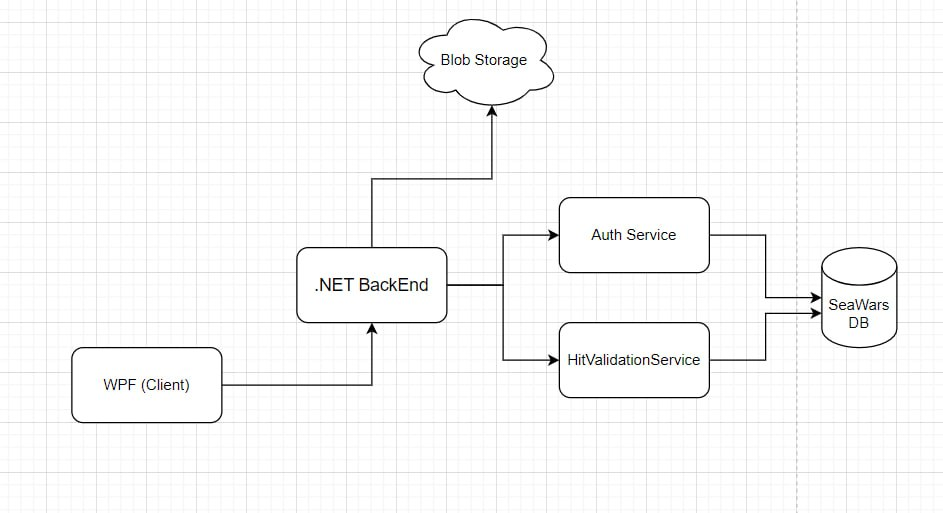

### CID Діаграма (Context Interaction Diagram)

На основі наданої діаграми, схема відображає взаємодію компонентів у системі:

1. **WPF (Client)**:
    - Виконує функцію клієнтського інтерфейсу, з яким взаємодіє користувач.
    - Відправляє запити до **.NET BackEnd** для виконання дій та отримання даних.

2. **.NET BackEnd**:
    - Основний серверний компонент, який координує всі взаємодії між клієнтом, сервісами та базою даних.
    - Спілкується з такими сервісами:
        - **Auth Service** для автентифікації користувачів.
        - **HitValidationService** для перевірки результатів гри.
    - Має доступ до **Blob Storage** для зберігання файлів.
    - Взаємодіє з базою даних **SeaWars DB** для збереження та отримання даних.

3. **Auth Service**:
    - Виконує автентифікацію користувачів.
    - Взаємодіє з **SeaWars DB** для перевірки облікових записів.

4. **HitValidationService**:
    - Відповідає за перевірку логіки попадань у грі.
    - Працює з базою даних **SeaWars DB** для отримання інформації про стан гри.

5. **Blob Storage**:
    - Містить файли, які потрібні для роботи системи або для зберігання мультимедійного контенту.

6. **SeaWars DB**:
    - Центральна база даних системи, яка містить інформацію про користувачів, стан гри, результати тощо.
    - Використовується як **Auth Service**, так і **HitValidationService**.

---

### Reliability, Maintainability, Availability (RMA)

#### Reliability (Надійність):
- **Ризики**: Ненадійність може виникнути через збої в базі даних (**SeaWars DB**) або збої у зовнішніх сервісах, таких як **Blob Storage**.
- **Запобігання**: Рекомендується реалізувати реплікацію бази даних і мати резервні копії для **Blob Storage**.

#### Maintainability (Підтримуваність):
- **Складність**: Система має добре розділені компоненти, що спрощує підтримку. Кожен сервіс відповідає за конкретну функцію (автентифікація, валідація тощо).
- **Покращення**: Варто застосувати принципи модульності та регулярного рефакторингу. Логіка повинна документуватись, а тести — регулярно оновлюватись.

#### Availability (Доступність):
- **Ризики**: Якщо **.NET BackEnd** недоступний, система втрачає основну функціональність. Залежність від **Auth Service** і **HitValidationService** також є вразливістю.
- **Запобігання**: Використання балансувальників навантаження, резервних серверів і моніторингу для забезпечення мінімального часу простою.